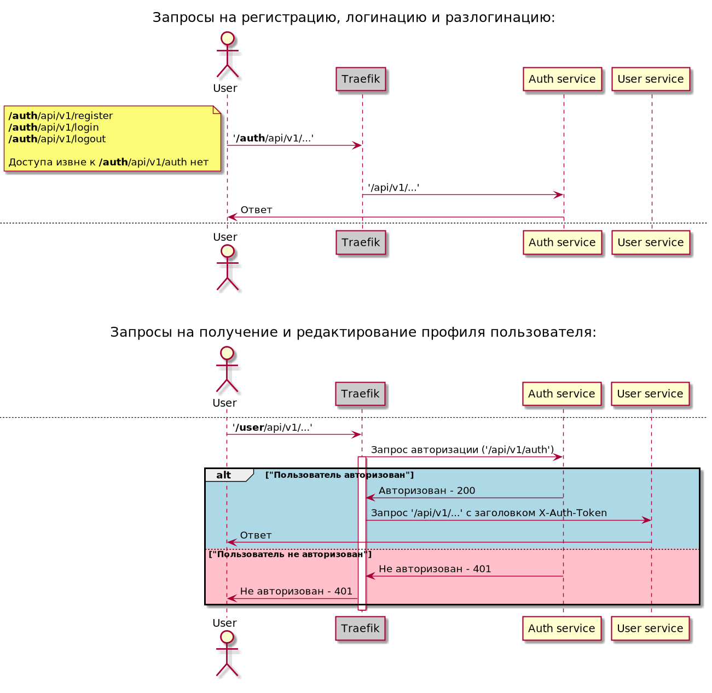

# Описание
#### Домашнее задание выполнено для курса "[Микросервисная архитектура](https://otus.ru/lessons/microservice-architecture)"

# Схема решения


# Сервисы
Сами сервисы расположен в папке `services`, при запуске в ней команды `make` собирается docker-образы сервисов.
API сервисов можно посмотреть в файлах `service/api/authapu.swagger.yaml` и `service/api/userapi.swagger.yaml`

# Инструкция по запуску

### Предварительная подготовка
1. Прописать в hosts домен `arch.homework` на ip кластера
2. При необходимости создать новый namespace и выбрать его, например:
```
kubectl create namespace arch-hw5 && kubectl config set-context --current --namespace=arch-hw5
```
3. Установить Nginx при отсутствии (или включить addon в minikube - `minikube addons enable ingress`)

### Установка приложения с помощью helm:
```
helm install hw7 helm/hw-umbrella-chart
```
# Тестирование
### Запуск тестов:
```
 newman run tests.postman_collection.json
```