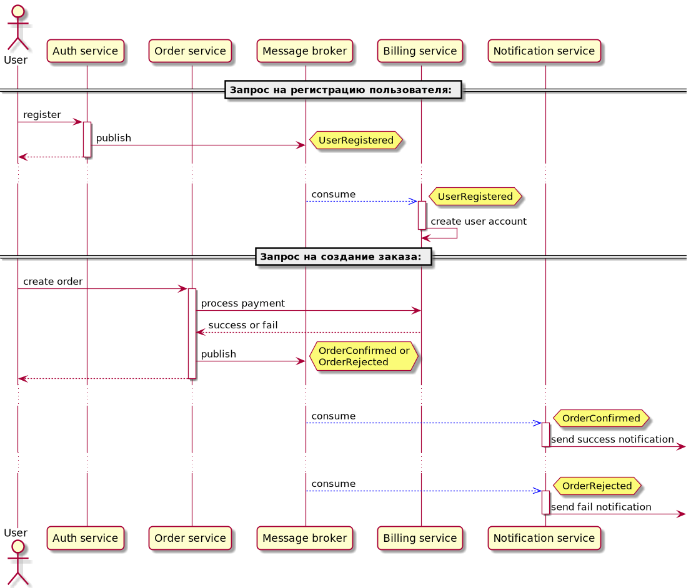

# Описание
#### Домашнее задание выполнено для курса "[Микросервисная архитектура](https://otus.ru/lessons/microservice-architecture)"

# Теоретическая часть

### Варианты взаимодействия
Варианты взаимодействия сервисов в виде sequence-диаграмм:
* [Только HTTP](assets/rest.png)
* [Event Collaboration](assets/event_collaboration.png)
* [Смешанный вариант (HTTP + события через брокера)](assets/rest_plus_events.png)

### Выбранный вариант
Для реализации выбран вариант смешанного взаимодействия. Тут для оплаты используется прямое HTTP-взаимодействие, а для регистрации в сервисе биллинга и отправки уведомлений - взаимодействие через брокера сообщений


# Сервисы
Сами сервисы расположен в папке `services`, при запуске в ней команды `make` собираются docker-образы сервисов.
API всех сервисов можно посмотреть в папке `service/api`

# Инструкция по запуску

### Предварительная подготовка
1. Прописать в hosts домен `arch.homework` на ip кластера
2. При необходимости создать новый namespace и выбрать его, например:
```
kubectl create namespace arch-hw7 && kubectl config set-context --current --namespace=arch-hw7
```
3. Установить Nginx при отсутствии (или включить addon в minikube - `minikube addons enable ingress`)

### Установка приложения с помощью helm:
```
helm install hw7 helm/hw-umbrella-chart
```
# Тестирование
### Запуск тестов:
```
 newman run tests.postman_collection.json
```